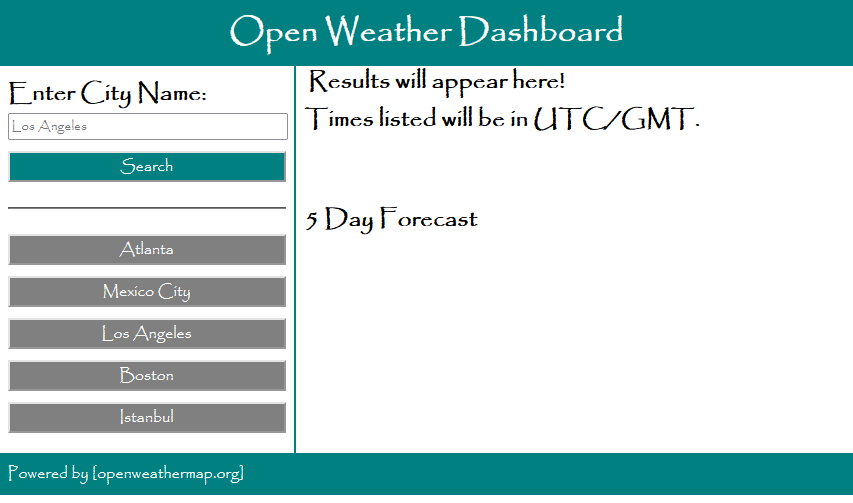

# Open Weather Map
## Deployment Link
https://luluco92.github.io/open-weather/

## Description
Simple weather dashboard where you can look up a city and get the weather of the current day, and a 5 day forecast there. Powered by the openweathermap API.
The dashboard also saves previous searches in local storage that can be quickly accessed again for convenience.

## Preview

